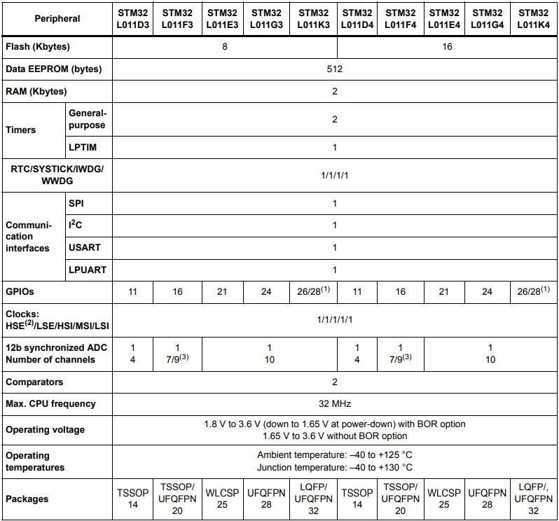

# [STM32L011](https://github.com/sochub/STM32L011)
 
#### 厂商：[ST](https://github.com/sochub/ST)
#### 父级：[STM32L0](https://github.com/sochub/STM32L0)
#### 架构：[cortex M0](https://github.com/sochub/CM0)
#### 芯片定级：[Level](https://github.com/sochub/Level)
## [描述](https://github.com/sochub/STM32L011) 

[STM32L011](https://github.com/sochub/STM32L011)基于ARM Cortex®-M0内核，主要应用于低功耗场景，拥有常用的外设和各种规格的封装，适用于小尺寸设计。

### [资源收录](https://github.com/sochub/STM32L011)

* [文档](docs/)
* [资源](src/)

### [关联资源](https://github.com/sochub)

* [SDK](https://github.com/sochub/SDK)

### [选型建议](https://github.com/sochub)

[STM32L011](https://github.com/sochub/STM32L011)系列是入门级STM32L系列单片机，适合低成本小尺寸简单应用。

###  [SoC资源平台](http://www.qitas.cn)
