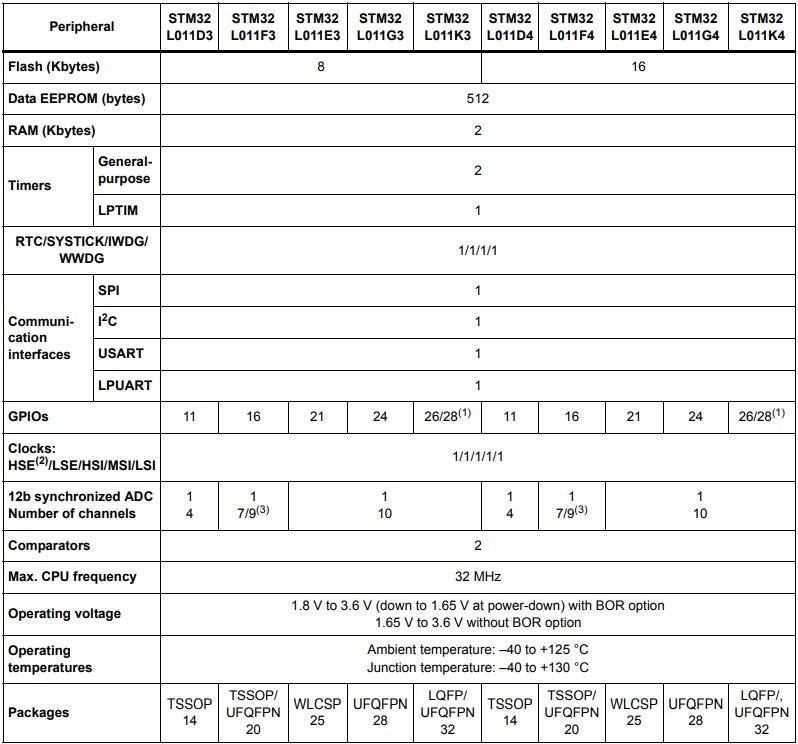

# [STM32L011](https://github.com/SoCXin/STM32L011)

#### [Vendor](https://github.com/SoCXin/Vendor)：[ST](https://github.com/SoCXin/ST)
#### [Core](https://github.com/SoCXin/Cortex)：[Cortex M0](https://github.com/SoCXin/CM0)
#### [Level](https://github.com/SoCXin/Level)：32MHz (0.95DMIPS/MHz)

## [描述](https://github.com/SoCXin/STM32L011/wiki)

[STM32L011](https://github.com/SoCXin/STM32L011)基于ARM Cortex®-M0内核，主要应用于低功耗场景，拥有常用的外设和各种规格的封装，适用于小尺寸设计。

### [资源收录](https://github.com/SoCXin/STM32L011)

* [文档](docs/)
* [资源](src/)

### [选型建议](https://github.com/SoCXin)

[STM32L011](https://github.com/SoCXin/STM32L011)系列是入门级STM32L系列单片机，适合低成本小尺寸简单应用。

###  [SoC芯平台](http://www.SoC.Xin)
